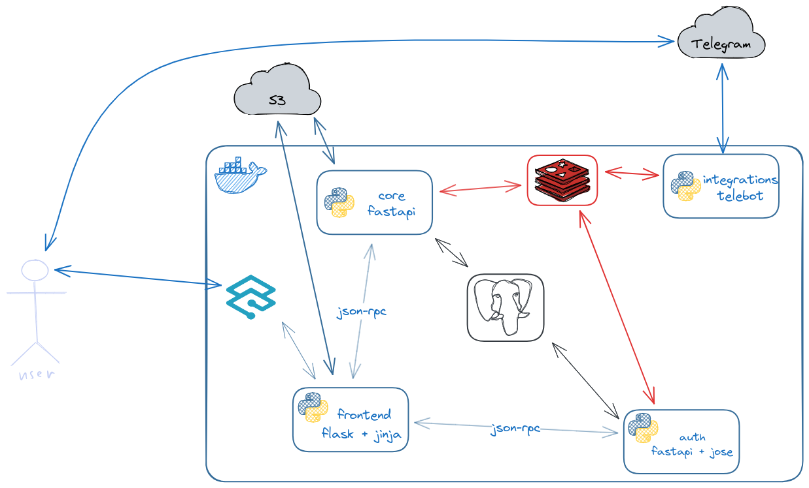

# Bookmytea
#### *Сервис для бронирования столов в гипотетической чайно*й
### Архитектура

На текущий момент у меня 4 микросервиса, в качестве БД - PostgreSQL и Redis, хранение изображений - сторонний S3 (хотелось бы minio, но не успел), реверс-прокси - Traefik

### Деплой
Docker compose, секреты и другие переменные хранятся отдельно в .env для каждого микросервиса отдельно. При пуше в main ветку триггерится CI/CD пайплайн, который собирает каждый микросервис и пушит в мой регистри (на той же машине, где задеплоен проект). В docker compose новые версии контейнеров подтягиваются автоматически с помощью Watchtower. Пример конфигурации:
```yaml
version: '3'

services:
  postgres_core:
    image: postgres:latest
    container_name: postgres_core
    environment:
      POSTGRES_USER: postgres
      POSTGRES_PASSWORD: postgres
      POSTGRES_DB: postgres
    volumes:
      - postgres_core:/var/lib/postgresql/data
    networks:
      - traefik-external

  postgres_auth:
    image: postgres:latest
    container_name: postgres_auth
    environment:
      POSTGRES_USER: postgres
      POSTGRES_PASSWORD: postgres
      POSTGRES_DB: postgres
    volumes:
      - postgres_auth:/var/lib/postgresql/data
    networks:
      - traefik-external

  redis:
    image: redis:latest
    container_name: redis
    volumes:
      - redis:/data
    networks:
      - traefik-external

  core:
    image: registry.onmyneck.online/core:latest
    container_name: core
    depends_on:
      - postgres_core
      - redis
    env_file:
      - .env_core
    labels:
      - "com.centurylinklabs.watchtower.enable=true"
    networks:
      - traefik-external

  auth:
    image: registry.onmyneck.online/auth:latest
    container_name: auth
    depends_on:
      - postgres_auth
      - redis
    env_file:
      - .env_auth
    labels:
      - "com.centurylinklabs.watchtower.enable=true"
    networks:
      - traefik-external

  integrations:
    image: registry.onmyneck.online/integrations:latest
    container_name: integrations
    depends_on:
      - core
      - auth
      - redis
    env_file:
      - .env_integrations
    restart: on-failure
    labels:
      - "com.centurylinklabs.watchtower.enable=true"
    networks:
      - traefik-external

  frontend:
    image: registry.onmyneck.online/frontend:latest
    container_name: frontend
    ports:
      - "8000:8000"
    depends_on:
      - core
      - auth
      - integrations
    env_file:
      - .env_frontend
    labels:
      - "com.centurylinklabs.watchtower.enable=true"
      - "traefik.enable=true"
      - "traefik.http.routers.frontend.rule=Host(`bookmytea.onmyneck.online`)"
      - "traefik.http.routers.frontend.entrypoints=websecure"
      - "traefik.http.routers.frontend.tls.certresolver=myresolver"
      - "traefik.http.services.frontend.loadbalancer.server.port=8000"
    networks:
      - traefik-external

  watchtower:
    image: containrrr/watchtower
    volumes:
      - /var/run/docker.sock:/var/run/docker.sock
    command: --interval 30
    networks:
      - traefik-external

volumes:
  postgres_core:
  postgres_auth:
  redis:

networks:
  traefik-external:
    external: true
```
Хранение секретов в .env:
```shell
root@even-toothbrush:~/bookmytea# tree -al
.
├── docker-compose.yml
├── .env_auth
├── .env_core
├── .env_frontend
└── .env_integrations
```
### Что удалось сделать?
- [x] Регистрация, авторизация, основной функционал
- [x] Привязка Telegram-аккаунта
- [x] CI/CD
- [x] Деплой
- [ ] Хранения изображений в S3
### Что не удалось сделать, но очень хотелось?
- [ ] Хранение изображений в Minio
- [ ] Уведомления в Telegram
- [ ] Админка
- [ ] Оптимизация (в том числе багфиксы, более эффективный код, кеширование)
- [ ] Тесты, линтеры
- [ ] Адекватная документация